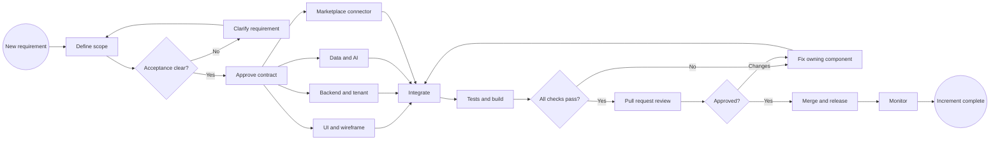
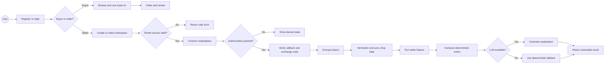

# AREA-303 — Project Process, BPMN và Workflow

Tài liệu này là quy trình vận hành chung cho toàn bộ AREA-303: từ lúc nhận yêu
cầu, chia việc, thiết kế contract, phát triển, kiểm thử, tích hợp, review, release
đến xử lý blocker. Nội dung phản ánh cấu trúc thực tế của repository tại thời
điểm 2026-08-12.

FigJam editable gồm ba sơ đồ:

- [AREA-303 Project Delivery BPMN](https://www.figma.com/board/wuJAIiRVv42dsWqtOMWIdO)
- Product Runtime BPMN nằm trong cùng FigJam.
- Stuck Resolution Workflow nằm trong cùng FigJam.

> Mermaid trong tài liệu là BPMN-style flowchart để GitHub và IDE render được.
> FigJam là bản dùng để trình bày và chỉnh sửa cùng nhóm.

## 1. Mục tiêu và phạm vi hệ thống

AREA-303 có hai luồng người dùng:

1. **Buyer:** xem cửa hàng, nhận gợi ý, dùng Personal Shopper/RecSys, đặt hàng,
   đánh giá và tạo dữ liệu hành vi.
2. **Seller:** tạo workspace, quản lý thành viên, kết nối shop trên sàn, đồng bộ
   sản phẩm/đơn hàng/tồn kho và dùng các chức năng AI hỗ trợ vận hành.

Các thành phần kỹ thuật chính:

| Thành phần | Trách nhiệm |
|---|---|
| Next.js frontend | Buyer storefront, seller workspace, dashboard và feature panels |
| FastAPI backend | Auth, RBAC, tenant guard, business API và AI orchestration |
| PostgreSQL | Users, workspaces, members, shops, orders, reviews và dữ liệu nghiệp vụ |
| Redis | Cache, rate limiting và trạng thái ngắn hạn |
| LLM layer | Gemini/OpenAI khi có key; mock hoặc deterministic fallback khi không có |
| Marketplace APIs | Shopee trước; mở rộng Lazada và TikTok Shop bằng connector riêng |
| CI | Ruff, mypy, pytest, migration, frontend lint/typecheck/build và Docker build |

## 2. Vai trò và trách nhiệm

| Vai trò | Own chính | Đầu ra bắt buộc |
|---|---|---|
| Team Lead / Product owner | Scope, ưu tiên, API/data contract, integration, release | Acceptance criteria, quyết định cuối, PR integration |
| UI & Dashboard | Information architecture, card, responsive layout, dashboard | Wireframe được duyệt, UI responsive, không mất feature |
| Marketplace Integration | OAuth/callback, token refresh, shop sync | Connector theo workspace, error states, mapping từng sàn |
| Data / AI | Dataset, deterministic metric, prompt/model, evaluation | Data contract, metric/evaluation, fallback an toàn |
| QA / Reviewer | Test contract, regression, security/tenant checks | Test evidence, defect list, approval hoặc change request |

Một file hoặc module chỉ có **một owner chính trong một iteration**. Người khác
có thể review nhưng không chỉnh cùng vùng code khi chưa thống nhất để tránh
conflict.

## 3. Project process chuẩn

### Phase 1 — Intake và Definition of Ready

1. Ghi requirement dưới dạng user outcome, không chỉ ghi tên feature.
2. Xác định actor: buyer, seller, admin hay background job.
3. Viết acceptance criteria có thể kiểm thử.
4. Xác định dữ liệu đầu vào, đầu ra và nguồn dữ liệu.
5. Xác định yêu cầu auth, role và workspace tenant.
6. Tách phần nào cần LLM và phần nào phải deterministic.
7. Chỉ đưa vào development khi không còn quyết định sản phẩm quan trọng bị bỏ ngỏ.

**Definition of Ready:** actor rõ, happy path rõ, error path rõ, contract sơ bộ rõ,
owner rõ và có cách verify.

### Phase 2 — Contract-first design

Trước khi frontend, backend, connector và AI code song song, nhóm chốt:

- Endpoint, method và response envelope.
- Pydantic/TypeScript request-response shape.
- Database entity và migration owner.
- `workspace_id` nằm ở đâu và dependency nào xác thực nó.
- Error codes: 401, 403, 404, 409, 422, 503.
- Trạng thái loading, empty, success, expired, revoked và error trên UI.
- Mock/fixture để các nhánh không phụ thuộc lẫn nhau khi phát triển.

Seller API phải nhận JWT và `X-Workspace-ID`. Không được tin `workspace_id` trong
request body nếu chưa đối chiếu membership ở backend.

### Phase 3 — Parallel implementation

- UI làm theo contract/mock đã duyệt.
- Backend viết route, schema, service, tenant guard và migration.
- Connector triển khai OAuth/callback/refresh theo contract workspace.
- Data/AI viết metric lõi, LLM explanation và fallback.
- Mỗi nhánh bổ sung test cùng lúc với code, không để đến cuối.

### Phase 4 — Integration

Thứ tự tích hợp an toàn:

1. Database migration.
2. Backend schema/service/API.
3. Frontend API client.
4. UI state và navigation.
5. Marketplace callback hoặc LLM provider.
6. End-to-end smoke test.

Mỗi lần tích hợp chỉ thay một contract lớn. Nếu thay database, API và UI contract
cùng lúc thì phải có checklist migration/backward compatibility rõ ràng.

### Phase 5 — Verification

Chạy tối thiểu:

```powershell
cd backend
$env:DEBUG="false"
python -m alembic upgrade head
python -m alembic check
python -m ruff check app tests alembic
python -m mypy app
python -m pytest -q

cd ..\frontend
npm run typecheck
npm run lint
npm run build
```

Ngoài test tự động, smoke test các luồng:

- Buyer đăng ký → login → browse → cart/order → review.
- Buyer tạo workspace → nhận role seller/token mới.
- Owner thêm member → member login → thấy đúng workspace.
- User workspace A không đọc được workspace B.
- OAuth bị từ chối, token hết hạn, revoked và reconnect.
- LLM có key, không có key, timeout và JSON lỗi.
- Giao diện desktop/mobile, loading/empty/error.

### Phase 6 — Review và release

1. Rebase/merge main vào feature branch và tự giải conflict trong phạm vi owner.
2. Điền PR: what, why, migration, security, screenshots và test evidence.
3. Reviewer kiểm tra acceptance criteria trước, style sau.
4. CI phải xanh; warning mới phải được giải thích.
5. Squash merge khi approved.
6. Sau release, chạy health/smoke test và theo dõi error log.
7. Ghi lại incident/lesson nếu có regression.

**Definition of Done:** code + tests + migration + docs + responsive/error state +
CI/build xanh + review approved; không chỉ là “chạy được trên máy người viết”.

## 4. BPMN — Project delivery



## 5. BPMN — Product runtime



## 6. Git workflow cho nhóm

```text
Issue / task
  → branch từ main
  → contract hoặc wireframe review
  → implement + test trong cùng branch
  → tự chạy targeted checks
  → rebase/merge main
  → full checks
  → PR + evidence
  → reviewer changes/approve
  → squash merge
  → smoke test sau merge
```

Quy tắc:

- Branch: `feat/<scope>-<name>`, `fix/<scope>-<name>`, `docs/<name>`.
- Không push trực tiếp `main`.
- Không commit `.env`, token, cookie marketplace, dữ liệu raw hoặc artifact QA lớn.
- Migration phải tăng revision tuyến tính và chạy được từ database trống.
- Thay API contract phải cập nhật cả Pydantic schema, TypeScript type và test.
- Nếu hai branch cùng sửa một file lõi, chốt owner và merge order trước khi code.

## 7. Workflow dữ liệu và AI

```text
Business question
  → define measurable output
  → inspect/clean source data
  → deterministic metric or retrieval
  → optional LLM explanation
  → validate JSON/output constraints
  → safe fallback
  → API envelope
  → UI action
  → evaluation and feedback
```

Nguyên tắc:

- LLM không thay thế phép tính có thể xác định bằng code.
- LLM dùng cho giải thích, tổng hợp, sinh nội dung và hội thoại.
- Không có API key hoặc LLM timeout thì feature vẫn trả fallback hợp lệ.
- Không đưa credential, password hoặc token marketplace vào prompt/log.
- Prompt/model thay đổi phải có fixture hoặc evaluation chứng minh không regression.

## 8. Workflow kết nối marketplace

```text
Seller chọn workspace
  → backend kiểm tra owner/manager
  → tạo signed OAuth state
  → chuyển đến đúng sàn
  → seller cấp hoặc từ chối quyền
  → callback kiểm tra state/expiry/nonce/membership
  → đổi authorization code lấy token
  → mã hóa token
  → upsert shop theo workspace/platform/external shop id
  → sync shop/products/orders/inventory
  → chuẩn hóa dữ liệu
  → cập nhật last_synced_at/status/error
```

Mỗi sàn có adapter và credential riêng. Không dùng API/token Shopee cho Lazada
hoặc TikTok Shop. Không lưu password tài khoản sàn.

## 9. Khi bị stuck — quy tắc 15/30/60

### Trong 15 phút đầu

1. Chụp lỗi chính xác: command, endpoint, request id, status, stack trace.
2. Reproduce bằng input nhỏ nhất.
3. Xác định lỗi thuộc frontend, API contract, database, AI hay external service.
4. Kiểm tra thay đổi gần nhất bằng `git diff` và test nhỏ liên quan.

### Sau 30 phút chưa giải quyết

Tạo một blocker note gồm:

```text
Expected:
Actual:
How to reproduce:
Evidence/log:
Already tried:
Suspected owner:
Can continue with mock/fallback?:
Decision needed:
```

Gửi đúng owner, không gửi chung chung “nó không chạy”. Trong khi chờ, tiếp tục
phần độc lập bằng mock/fixture nếu không làm sai contract.

### Sau 60 phút hoặc blocker ảnh hưởng critical path

Escalate Team Lead với 2–3 lựa chọn và impact:

- Giữ scope và tăng thời gian.
- Dùng fallback/mock có ghi rõ giới hạn.
- Cắt phần không critical khỏi iteration.

Không tự đổi contract, tắt security, bỏ tenant guard hoặc lưu token plaintext để
“chạy cho được”.

## 10. Playbook theo loại blocker

| Blocker | Kiểm tra đầu tiên | Cách unblock an toàn | Không được làm |
|---|---|---|---|
| Frontend build/type | `npm run typecheck`, lỗi đầu tiên | Sửa type/contract từ nguồn | `any` hàng loạt, bỏ validation |
| Backend test | Targeted test rồi full suite | Reproduce nhỏ, sửa service owner | Bỏ test hoặc đổi assertion vô lý |
| Database migration | `alembic current/check` | Tạo migration mới, backup dev data | Sửa migration đã release tùy tiện |
| 401/403/404 tenant | JWT role, header, membership | Dùng dependency chuẩn | Tin workspace id từ body |
| OAuth callback | state, redirect URI, clock, code | Retry với nonce mới, log sanitized | Log token/code hoặc lưu password |
| Token expired/revoked | status và refresh expiry | Refresh hoặc reconnect | Vòng retry vô hạn |
| Marketplace rate limit | status/Retry-After | Backoff, queue, cached data | Spam retry đồng thời |
| LLM quota/timeout | provider/key/timeout | Mock hoặc deterministic fallback | Làm toàn endpoint fail |
| Bad LLM JSON | raw shape không chứa secret | Parse guard, schema retry một lần, fallback | Trả raw output thẳng UI |
| Merge conflict | owner và contract hiện tại | Merge theo thứ tự, rerun tests | Ghi đè file người khác |
| CI khác local | version/env/lockfile | Reproduce bằng CI command/container | Merge khi CI đỏ |
| Thiếu quyết định | acceptance criteria | Đưa options + impact cho lead | Tự đoán thay đổi scope lớn |

## 11. Incident workflow sau release

1. **Detect:** ghi thời điểm, actor, workspace, request id; không ghi secret.
2. **Contain:** tắt riêng connector/job lỗi hoặc chuyển fallback; không tắt toàn hệ thống nếu không cần.
3. **Assess:** dữ liệu nào bị ảnh hưởng, tenant nào, từ lúc nào.
4. **Recover:** rollback release hoặc roll-forward bằng fix nhỏ nhất.
5. **Verify:** smoke test, tenant isolation và data consistency.
6. **Prevent:** thêm regression test, alert và cập nhật runbook.

Mức độ gợi ý:

- **P0:** lộ credential hoặc dữ liệu cross-tenant — dừng luồng liên quan ngay.
- **P1:** auth/order/sync hỏng cho nhiều user — xử lý ngay, có fallback nếu an toàn.
- **P2:** một AI feature lỗi nhưng core commerce chạy — fallback và sửa trong ngày.
- **P3:** lỗi UI/copy không chặn tác vụ — đưa vào backlog gần nhất.

## 12. Checklist trước khi báo hoàn thành

- [ ] Acceptance criteria đã đạt.
- [ ] Happy path và error path đều có test.
- [ ] Workspace tenant isolation đã kiểm tra nếu là seller data.
- [ ] Token/secret không xuất hiện trong response, log hoặc commit.
- [ ] Migration upgrade và `alembic check` sạch.
- [ ] Ruff, mypy và pytest sạch.
- [ ] Frontend typecheck, lint và production build sạch.
- [ ] UI có loading, empty, error và responsive state.
- [ ] Docs/contract đã cập nhật cho người tích hợp tiếp theo.
- [ ] PR có test evidence và reviewer approval.
- [ ] Smoke test sau merge thành công.

## 13. Tài liệu liên quan

- [Contributing](CONTRIBUTING.md)
- [Seller workspace integration](SELLER_WORKSPACE_INTEGRATION.md)
- [Root README](../README.md)
- [Backend README](../backend/README.md)
- [CI workflow](../.github/workflows/ci.yml)
